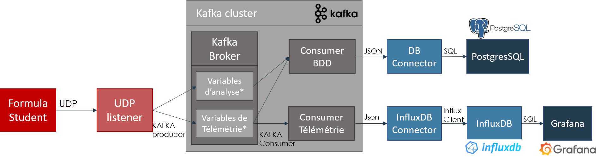

<!-- PROJECT LOGO -->
<br />
<p align="center">
  <a href="https://github.com/github_username/repo_name">
    
  </a>

  <h3 align="center">Télémétrie VED</h3>

  <p align="center">
    Système de Télémétrie pour l'association VED cette solution a 2 fonctions Télémétrie en temps réel et stockage long terme pour les simulations
  </p>
</p>


<!-- GETTING STARTED -->
# Getting Started

Suivez touttes ces étapes afin de faire fonctionner/déployer le projet

## Prérequis

Le seul programme requis est docker il sera en charge de l'orchestration de tous les services, je vous conseille d'utiliser [docker desktop](https://www.docker.com/products/docker-desktop) si vous avez windows 10 pro ou une configuration avec linux. En revanche bien que docker toolbox soit utilisable avec celui-ci nous ne sommes pas à l'abri de dysfonctionnements.
Si vous voulez faire des tests sans la FS vous pouvez instaler [python](https://docs.anaconda.com/anaconda/install/) et executer les différent DataGenerator(PE/PS) dans le dossier script 

## Installation

1. Cloner ce repos dans un nouveau dossier
   ```sh
   git clone https://github.com/github_username/repo_name.git
   ```
2. Vous pouvez maintenant lancer de fichier avec la commande
    ```sh
   docker-compose up
   ```
3. Lorsque vous vous arrêtez le docker-compose ou lorsque vous le redémarrez n'oubliez pas de faire cette commande. Pour le moment il y a un problème au redémarrage avec kafka et zookeeper
    ```sh
   docker-compose rm -svf
   ```


# Documentation

Dans cette partie je vais expliquer comment fonctionne l'application et justifier les choix techniques que j'ai pu faire

## Contraintes
Avant toutes choses je vais rappeler mon cahiers des charges:
La solution présentée se divise en 2 parties:
* une partie datalogging via une BDD:

    - La fréquence d'échantillonage doit être aux alentour des 100Hz

    - Le stockage axé sur le lojng terme pour des futures simulations

* une partie dataviz/monitoring en temps réel:

    - Possibilité d’avoir plusieurs utilisateurs en simultané

    - Fréquence d'échantillonage au choix

    - Flexible, possibilité de changer la fenêtre de temps

    - Intelligent, possibilité de mettre des valeurs seuil

    - Scalable, possibilité d'avoir plusieurs utilisateurs en simultané


D'un point de vue matériel les données seront réccupérées sur 3 BUS CAN différents puis transmises via une [gateway 4G](https://teltonika-networks.com/fr/product/trb140/)




# Pour les curieux
La plupart des services utilisés dans cette pipeline étaient nouveaux j'ai donc recensé les liens les plus intéressants que j'ai trouvés lors de mes recherches. J'espère que cela vous permettra de gagner du temps et de mieux comprendre ce j'ai pu faire

## Kafka

- Celui-ci propose un Quickstart qui nous est largement suffisant pour notre utilisation de kafka:
[Apache Kafka: Docker Container and examples in Python | Towards Data Science](https://towardsdatascience.com/kafka-docker-python-408baf0e1088)

- Celui-ci pousse un petit peu plus loin notamment si l’on veut augmenter l’uptime de l’application, il rentre dans le détail du fonctionnements de brokers et des partitions:
[A Simple Apache Kafka Cluster With Docker, Kafdrop, and Python | by Leo Brack | Better Programming | Oct, 2020 | Medium](https://medium.com/better-programming/a-simple-apache-kafka-cluster-with-docker-kafdrop-and-python-cf45ab99e2b9)


## Grafana/InfluxDB
- Celui-ci montre comment configurer grafana au premier démarrage:
[Connect Grafana to InfluxDB and show data | WirelessThings](https://wirelessthings.io/index.php/2020/07/30/connect-grafana-to-influxdb-and-show-data/)

- Avec grafana il est possible de déclencher des triggers pour effectuer une action si des valeurs seuils sont déclenchées. De plus cet exemple implémente une pipeline un peu pus légère que la nôtre grâce à MQTT
[Playing With Docker, MQTT, Grafana, InfluxDB, Python, and Arduino - DZone IoT](https://dzone.com/articles/playing-with-docker-mqtt-grafana-influxdb-python-a)

<!-- USAGE EXAMPLES -->
# ToDo
- réfléchir sur le déploiement de la solution (vpn pour hébergement au pôle, répartition des services ?)
- côté voiture problème actualisation de l’IP (via modification du code, serveur DNS, Système de shakehand) 
- Implémenter le DB connector 
- Configurer un panel par défaut au premier démarrage
- Faire un meilleur système de correspondance adresse CAN nom de variable
- Test de charge réseau


<!-- ACKNOWLEDGEMENTS -->
## Acknowledgements

* []()
* []()
* []()
